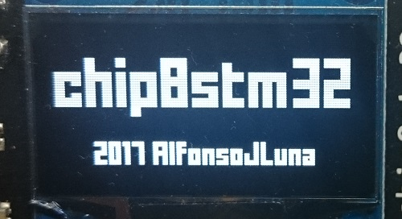
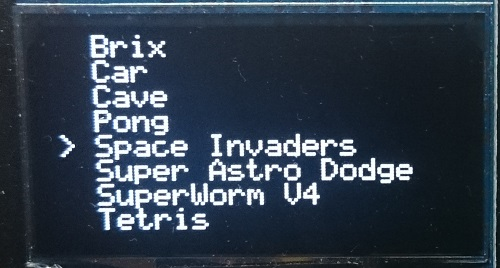
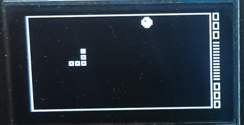
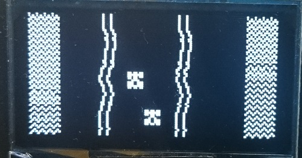
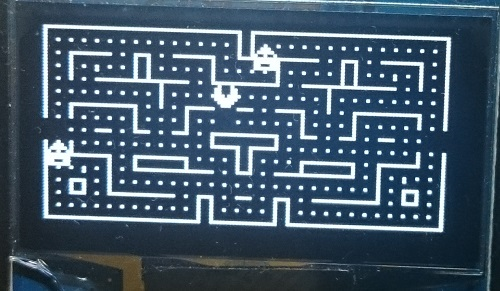
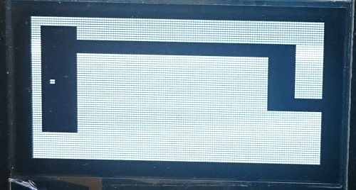
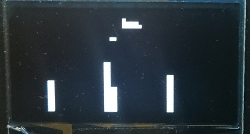
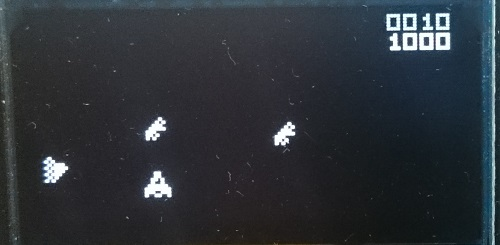
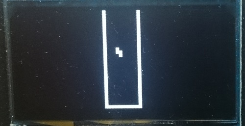

# chip8stm32

chip8stm32 is a handheld computer based on a STM32 microcontroller. It includes all the peripherals needed to play CHIP-8 and Super-CHIP games on the go: a hexadecimal keypad, a 128x64 OLED display and a passive buzzer. The included firmware uses the same core as [chip8swemu](https://github.com/AlfonsoJLuna/chip8swemu) for emulation.

Watch it in action: https://www.youtube.com/watch?v=vA76s3j4H90

    

## Game gallery

 |  | 
:-----------: | :-------------: | :-------------:
Splash screen | Menu | SuperWorm V4
 |  | 
Space Invaders | Car | Blinky
 |  | 
Cave | Blitz | Brix
 |  | 
Pong | Super Astro Dodge | Tetris

## Building the firmware

1. Add your games to the `games.h` header file. You can convert your games from binary format to a C array using xxd: `xxd -i game.ch8`.

**How to build:**

2. [Download](https://gnutoolchains.com/arm-eabi/) and install the GNU ARM Embedded Toolchain. Be sure you check `Add to PATH` during installation.
3. [Install](http://www.st.com/en/embedded-software/stsw-link004.html) the STM32 ST-LINK Utility. You need to add its folder to PATH manually.
4. Clone or download this repository.
5. Open a command prompt in `chip8stm32/Firmware/` and type `make` for building.

**How to flash:**

6. Connect the board to the computer using a ST-LINK Programmer and type `make flash` for flashing.

## License

* Hardware in this repository is licensed under the CERN OHL v1.2 license.
* Firmware in this repository is licensed under the MIT license.

This repository may contain libraries or other files provided by third parties. The above licenses do not apply to these files.
